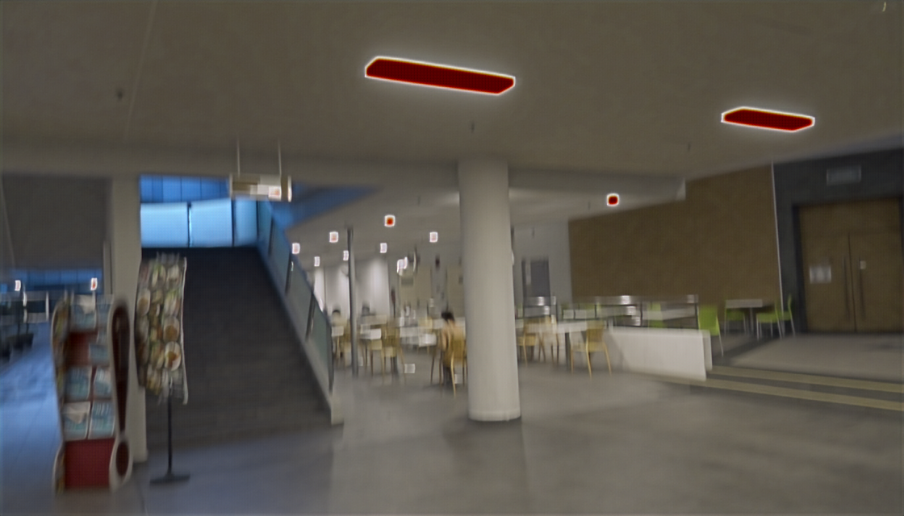
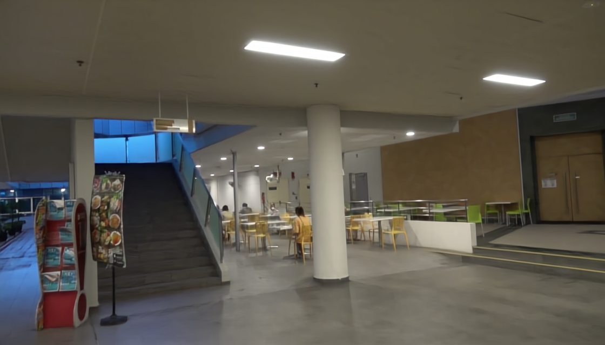
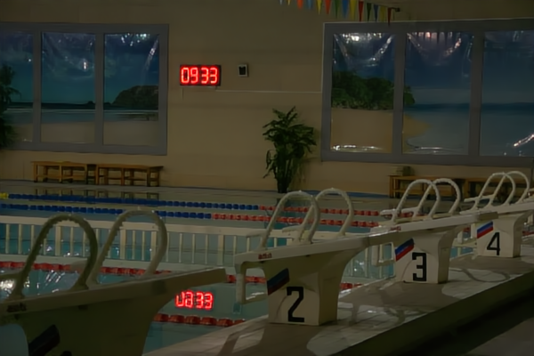
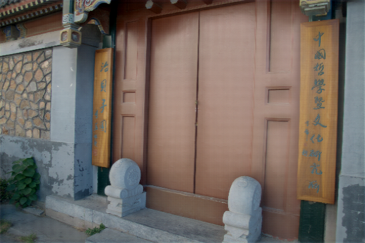
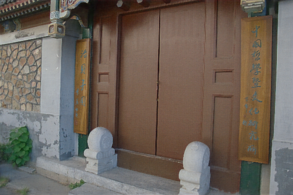
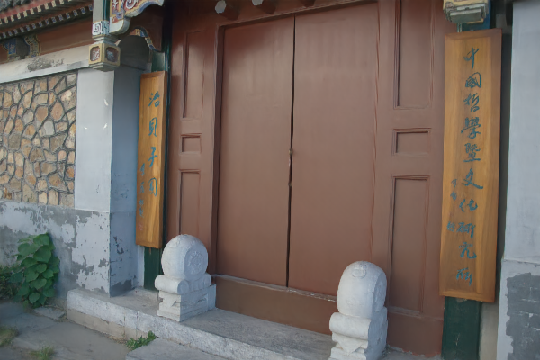
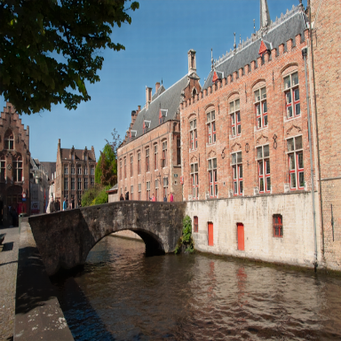
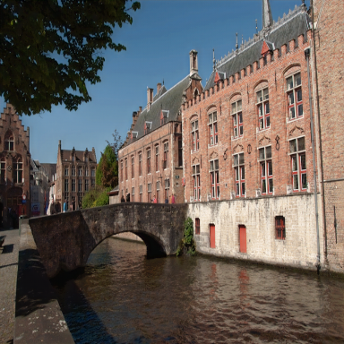
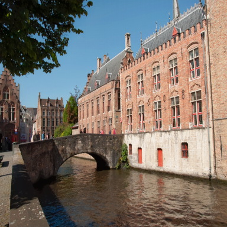

# [CVPR 2025] DarkIR: Robust Low-Light Image Restoration

[](https://huggingface.co/spaces/Cidaut/DarkIR) 
[](https://arxiv.org/abs/2412.13443)

**[Daniel Feijoo](https://scholar.google.com/citations?hl=en&user=hqbPn4YAAAAJ), [Juan C. Benito](https://scholar.google.com/citations?hl=en&user=f186MIUAAAAJ), [Alvaro Garcia](https://scholar.google.com/citations?hl=en&user=c6SJPnMAAAAJ), [Marcos V. Conde](https://scholar.google.com/citations?user=NtB1kjYAAAAJ&hl=en)** (CIDAUT AI  and University of Wuerzburg)

🚀 Try the model for free in 🤗 [HuggingFace Spaces: DarkIR](https://huggingface.co/spaces/Cidaut/DarkIR), download [model weights/checkpoint](https://cidautes-my.sharepoint.com/:f:/g/personal/alvgar_cidaut_es/Epntbl4SucFNpeIT_jyYZ-cB9BamMbacbyq_svrkMCpShA?e=XB9YBB) and [HF checkpoint](https://huggingface.co/Cidaut/DarkIR/). 

**TLDR.** In low-light conditions, you have noise and blur in the images, yet, previous methods cannot tackle dark noisy images and dark blurry using a single model. We propose the first approach for all-in-one low-light restoration including illumination, noisy and blur enhancement.

*We evaluate our model on LOLBlur, RealLOLBlur, LOL, LOLv2 and LSRW. Follow this repo to receive updates :)*

<details>
<summary> <b> ABSTRACT </b> </summary>
>Photography during night or in dark conditions typically suffers from noise, low light and blurring issues due to the dim environment and the common use of long exposure. Although Deblurring and Low-light Image Enhancement (LLIE) are related under these conditions, most approaches in image restoration solve these tasks separately. In this paper, we present an efficient and robust neural network for multi-task low-light image restoration. Instead of following the current tendency of Transformer-based models, we propose new attention mechanisms to enhance the receptive field of efficient CNNs. Our method reduces the computational costs in terms of parameters and MAC operations compared to previous methods. Our model, DarkIR, achieves new state-of-the-art results on the popular LOLBlur, LOLv2 and Real-LOLBlur datasets, being able to generalize on real-world night and dark images.
</details>


|  |  |  |
|:-------------------------:|:-------------------------:|:-------------------------:|
| Low-light w/ blur                | RetinexFormer                 | **DarkIR** (ours)    |
|  |  |  |
| Low-light w/o blur                 | LEDNet    | **DarkIR** (ours)                 |

&nbsp;

## Network Architecture


## Dependencies and Installation

- Python == 3.10.12
- PyTorch == 2.5.1
- CUDA == 12.4
- Other required packages in `requirements.txt`

```
# git clone this repository
git clone https://github.com/Fundacion-Cidaut/DarkIR.git
cd DarkIR

# create python environment
python3 -m venv venv_DarkIR
source venv_DarkIR/bin/activate

# install python dependencies
pip install -r requirements.txt
```

## Datasets
The datasets used for training and/or evaluation are:

|Dataset     | Sets of images | Source  |
| -----------| :---------------:|------|
|LOL-Blur    | 10200 training pairs / 1800 test pairs| [LEDNet](https://github.com/sczhou/LEDNet) |
|LOLv2-real        | 689 training pairs / 100 test pairs | [Google Drive](https://drive.google.com/file/d/1dzuLCk9_gE2bFF222n3-7GVUlSVHpMYC/view) |
|LOLv2-synth        | 900 training pairs / 100 test pairs | [Google Drive](https://drive.google.com/file/d/1dzuLCk9_gE2bFF222n3-7GVUlSVHpMYC/view) |
|LOL      | 485 training pairs / 15 test pairs | [Official Site](https://daooshee.github.io/BMVC2018website/)  |
|Real-LOLBlur | 1354 unpaired images  | [LEDNet](https://github.com/sczhou/LEDNet)  |
|LSRW-Nikon | 3150 training pairs / 20 test pairs | [R2RNet](https://github.com/JianghaiSCU/R2RNet) |
|LSRW-Huawei | 2450 training pairs / 30 test pairs | [R2RNet](https://github.com/JianghaiSCU/R2RNet) |
<!-- |DICM|||
|NPE|||
|MEF|||
|LIME|||
|VV||| -->

You can download each specific dataset and put it on the `/data/datasets` folder for testing. 

## Results 
We present results in different datasets for DarkIR of different sizes. While **DarkIR-m** has channel depth of 32, 3.31 M parameters and 7.25 GMACs, **DarkIR-l** has channel depth 64, 12.96 M parameters and 27.19 GMACs.

|Dataset     | Model| PSNR| SSIM  | LPIPS |
| -----------| :---------------:|:------:|------|------|
|LOL-Blur    | DarkIR-m| 27.00| 0.883| 0.162|
|   | DarkIR-l| 27.30| 0.898| 0.137|
|LOLv2-real  | DarkIR-m| 23.87| 0.880| 0.186|
|LOLv2-synth | DarkIR-m| 25.54| 0.934| 0.058|
|LSRW-Both | DarkIR-m| 18.93| 0.583| 0.412|

We present perceptual metrics for Real-LOLBlur dataset:

| Model| MUSIQ| NRQM  | NIQE |
| -----------| :---------------:|:------:|:------:|
| DarkIR-m| 48.36| 4.983| 4.998|
| DarkIR-l| 48.79| 4.917| 5.051|

> LOLBlur results were obtained training the network only in this dataset. Best results in LOLv2-real, LOLv2-synth and both LSRW were obtained in a multitask training of the three datasets with LOLBlur (getting 26.63 PSNR and 0.875 SSIM in this dataset). Finally Real-LOLBlur results were obtained with a model trained in LOLBlur.

In addition, we tested our **DarkIR-m** in Real-World LLIE unpaired Datasets (downloaded from [Drive](https://drive.google.com/drive/folders/0B_FjaR958nw_djVQanJqeEhUM1k?usp=sharing)):

| | DICM| MEF  | LIME | NPE | VV |
| -----------| :---------------:|:------:|:------:|:------:|:------:|
| BRISQUE| 18.688| 13.903| 21.62| 12.877|  26.87|
| NIQE| 3.759| 3.448| 4.074| 3.991|  3.74|

<!-- 
## Training

Network can be trained from scratch running 

```python train.py```

Configuration file for this training can be found in `/options/train/Baseline.yml`. There you can select the dataset that you want to train with. -->

## Evaluation

To check our results you could run the evaluation of DarkIR in each of the datasets:

- Download the weights of the model from [OneDrive](https://cidautes-my.sharepoint.com/:f:/g/personal/alvgar_cidaut_es/Epntbl4SucFNpeIT_jyYZ-cB9BamMbacbyq_svrkMCpShA?e=XB9YBB) and put them in `/models`.
- run `python testing.py -p ./options/test/<config.yml>`. Default is LOLBlur.

> You may also check the qualitative results in `Real-LOLBlur` and LLIE unpaired by running `python testing_unpaired.py -p ./options/test/<config.yml>`. Default is RealBlur.

## Inference

You can restore a whole set of images in a folder by running: 

```python inference.py -i <folder_path>```

Restored images will be saved in `./images/results`.

To inference a video you can run

```python inference_video.py -i /path/to/video.mp4```

which will be saved in `./videos/results`.

## Gallery

<p align="center"> <strong>  LOLv2-real </strong> </p>

|  |  |  |  |  |
|:-------------------------:|:-------------------------:|:-------------------------:|:-------------------------:|:-------------------------:|
| Low-light                | SNR-Net | RetinexFormer    | **DarkIR** (ours) | Ground Truth                 |

<p align="center"> <strong>  LOLv2-synth </strong> </p>

|  |  |  |  |  |
|:-------------------------:|:-------------------------:|:-------------------------:|:-------------------------:|:-------------------------:|
| Low-light                | SNR-Net | RetinexFormer    | **DarkIR** (ours) | Ground Truth                 |

&nbsp;

<p align="center"> <strong>  Real-LOLBlur-Night </strong> </p>


<p align="center">   </p>

## Citation and acknowledgement

This work has been accepted for publication and presentation at The IEEE/CVF Conference on Computer Vision and Pattern Recognition (CVPR) 2025.

```
@inproceedings{feijoo2024darkir,
  title={DarkIR: Robust Low-Light Image Restoration},
  author={Feijoo, Daniel and Benito, Juan C and Garcia, Alvaro and Conde, Marcos V},
  booktitle={IEEE/CVF Conference on Computer Vision and Pattern Recognition (CVPR)},
  year={2025}
}
```

## Contact

If you have any questions, please contact danfei@cidaut.es and marcos.conde@uni-wuerzburg.de

